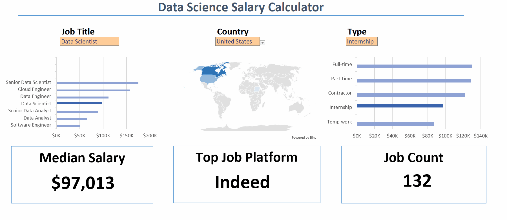
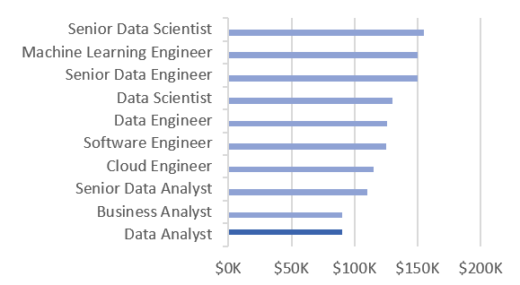
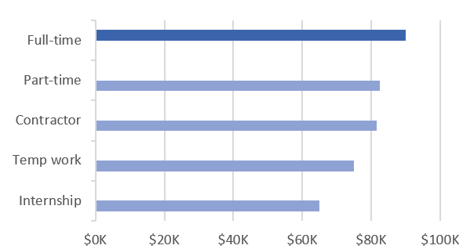
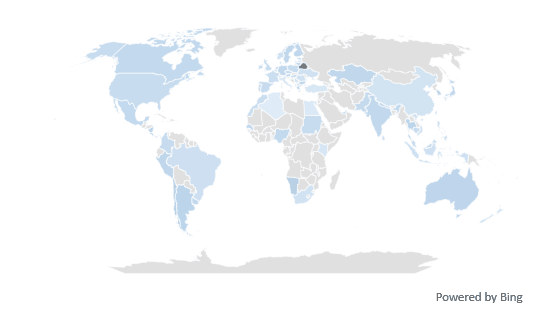
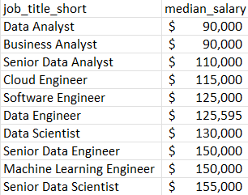
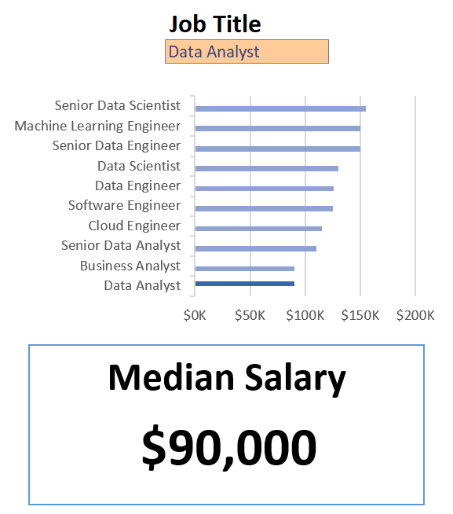
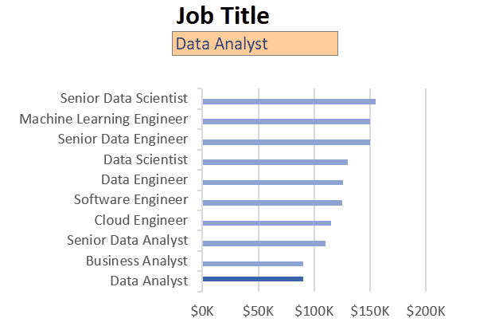

# Excel Salary Dashboard



## Introduction

This data jobs salary dashboard is a great tool for people looking for work. It helps us check the pay for the jobs we want, so we can be sure we are getting paid fairly. The information included—such as job titles, salaries, locations, and the top platforms that post these opportunities—comes from the dataset we used in our Excel class. That class gave me the basics of how to use that powerful tool to analyze data.

### Dashboard File

My Final dashboard is in [here](1_salary_dashboard.xlsx)

### Excel Skill Used

The main Excel skills I utilized for this analysis were:

- 📊 Charts, to visualize the salary data effectively.
- ➕ Formulas and Functions, for all the necessary calculations and data manipulation.
- ✅ Data Validation, to keep the data input clean and accurate, ensuring reliable analysis."

### Data Jobs Datasets

I built this project using a real-world dataset filled with Data Science job details from 2023. This valuable data was provided as part of the Excel course I took, which gave me the foundation for analyzing data using Excel.

The dataset includes detailed information on:

- 👨‍💼 Job titles
- 💰 Salaries
- 📍 Locations

## Dashboard Build

### Chart

#### 📊 Data Science Job Salaries - Bar Chart



For the main Salary Bar Chart, I focused on clear presentation:

- 🛠️ Excel Feature Use: I utilized the horizontal bar chart feature and optimized the chart layout for clarity, including properly formatted salary values.

- 📉 Data Organization: I sorted the job titles by descending salary to make the dashboard easy to read.

- 💡 Insights Gained: This design enables a quick identification of salary trends. The main takeaway is that Senior roles and Engineer roles consistently show higher median salaries compared to Analyst roles."

#### And Also For Job Work Type Chart



#### Country Median Salaries - Map Chart



To understand the global picture, I created a Map Chart:

- 🛠️ Excel Features: I utilized Excel's map chart feature to plot the median salaries globally.

- 🎨 Design Choice: I used a color-coded map to visually differentiate salary levels across various regions.

- 📊 Data Representation: This chart clearly plots the median salary for each country where data was available.

- 👁️ Visual Enhancement: This feature greatly improved readability and provided an immediate understanding of geographic salary trends.

- 💡 Insights Gained: The map enables a quick grasp of global salary disparities and immediately highlights regions with high or low median salaries.

### 🧮 Formulas and Functions

#### 💰 Median Salary by Job Titles

```
=MEDIAN(
   IF(
      (jobs[job_title_short]=A2) *
      (jobs[salary_year_avg]<>0) *
      (jobs[job_country]=country) *
      (ISNUMBER(SEARCH(type, jobs[job_schedule_type]))),
       jobs[salary_year_avg]
      )
)
```

| Formula Purpose             |                                                                                     Detail                                                                                     |
| :-------------------------- | :----------------------------------------------------------------------------------------------------------------------------------------------------------------------------: |
| 🔢 Core Function            |                                      This formula populates the main salary table, returning the median salary based on user selections.                                       |
| 🔍 Multi-Criteria Filtering | It uses nested `IF()` statements to simultaneously check and filter data by: job title, country, schedule type (e.g., remote/hybrid), and ensures blank salaries are excluded. |
| 📊 Array Formula Power      |            By combining `MEDIAN()` with the nested `IF()` inside an array, I was able to analyze vast amounts of data to return highly specific, tailored results.             |
| 🎯 Tailored Insights        |                         This method provides users with highly specific salary information filtered exactly by job title, region, and employment type.                         |

Background Table



The Implementation



### ❎ Data Validation

#### 🔍 Filtered List

The final step was ensuring a smooth user experience through data validation:

- 🔒 Enhanced Data Validation: I implemented the clean, filtered list as a data validation rule for the `Job Title`, `Country`, and `Type` options.

- 🎯 Result: This step ensures that user input is restricted to predefined, validated schedule types, preventing incorrect or inconsistent entries and significantly enhancing the overall usability of the dashboard.



## Conclusion

I created this dashboard to showcase **key insights into salary trends** across various data-related job titles. Utilizing the real-world data from the Excel course, this project allowed me to demonstrate foundational to advanced analysis skills.

This tool now empowers users to **make informed decisions** about their career path by **quickly exploring the functionalities** to understand exactly how **location and job type influence** salaries on a global and regional scale. This dashboard is a direct result of applying the skills learned in my course.
