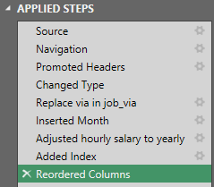
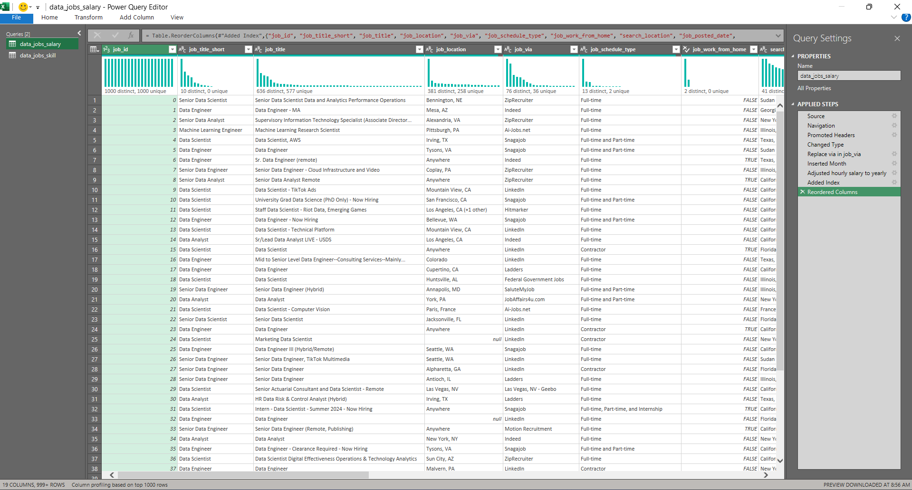
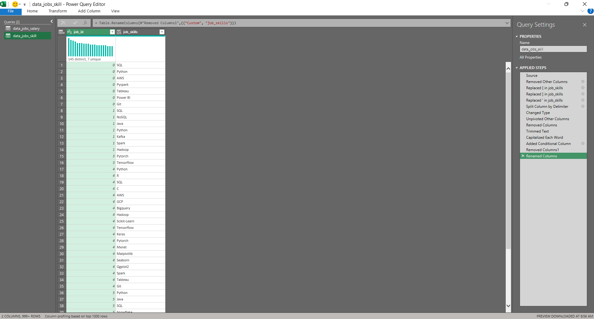
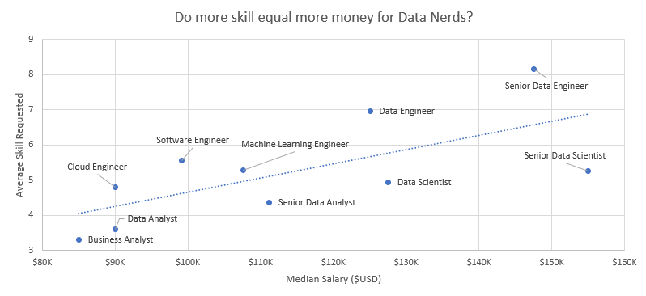
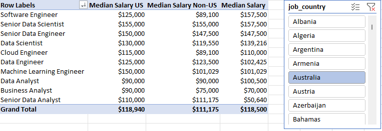
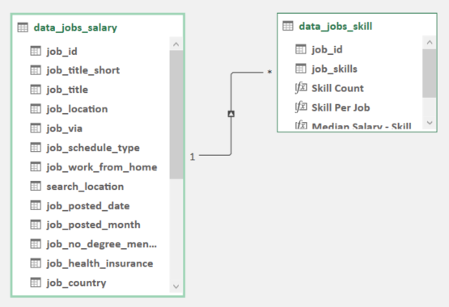
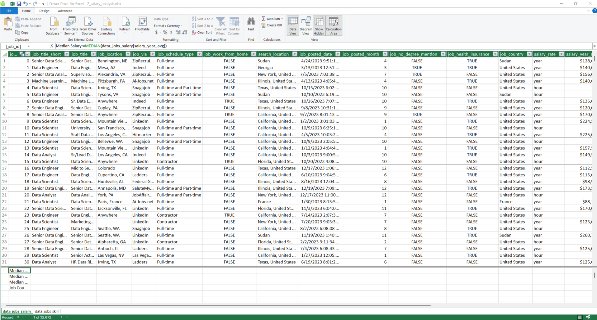
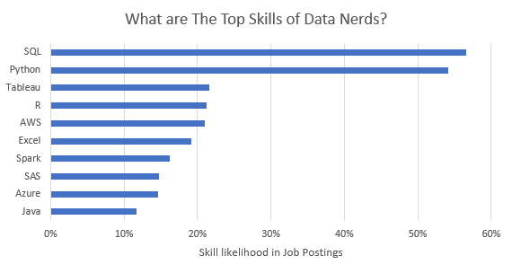
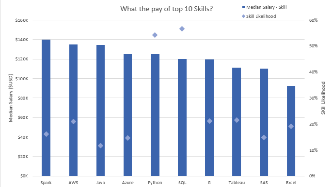

# Project 2 Salary Analysis

## My Motivation & Goal💡

As someone who was recently job searching, I was surprised by the lack of clear data on the most optimal jobs and valuable skills within the data science sector.

This realization motivated me to leverage the tools and techniques I acquired from my course/training to conduct an in-depth analysis. My primary goal for this project is highly practical: to understand exactly which skills are being requested by top employers and how I can strategically position myself to achieve a higher salary.

### Key Questions I Need to Answer 🧐

To structure my analysis and derive actionable insights from the job market data, I set out to answer the following questions:

1. **Skill-Pay Correlation**: Does simply having more skills translate into better compensation?
2. **Geographic Salary**: What are the salary figures for data roles when comparing different regions?
3. **In-Demand Skills**: What are the top skills that data professionals must possess in this current market?
4. **Top Skill Value**: What is the average pay specifically associated with the top 10 most valuable skills?

### Excel Tools I Leveraging 🛠️

Applying what I've learned, I am utilizing the advanced capabilities of Microsoft Excel to effectively manage and analyze the dataset, focusing on:

- **Data Summarization & Visualization**: Using 📊 Pivot Tables and 📈 Pivot Charts to summarize complex information and visualize key trends.
- **Data Transformation**: Employing 🔍 Power Query to connect, clean, and shape the raw data efficiently.
- **Modeling & Metrics**: Building comprehensive data models with 💪 Power Pivot and defining essential metrics using the 🧮 DAX (Data Analysis Expressions) language.

### Data Jobs Datasets

I built this project using a real-world dataset filled with Data Science job details from 2023. This valuable data was provided as part of the Excel course I took, which gave me the foundation for analyzing data using Excel.

The dataset includes detailed information on:

- 👨‍💼 Job titles
- 💰 Salaries
- 📍 Locations
- 🛠️ Skills

## 1️⃣ Does simply having more skills translate into better compensation?

### 🔍 Skill: Power Query (ETL)

#### 📥 Extract

- I first used Power Query to extract the original data (`data_salary_all.xlsx`) and create two queries:
  - 🗃️ First one with all the data jobs information.
  - 🔧 The second listing the skills for each job ID.

#### 🔄 Transform

- Then, I transformed each query by changing column types, removing unnecessary columns, cleaning text to eliminate specific words, and trimming excess whitespace.

  - 📊 data_jobs_all

  

  ```M
  let
    Source = Excel.Workbook(File.Contents("D:\Excel_Data_Analytics_Course\Excel_Data_Analytics_Course-main\0_Resources\Datasets\data_jobs_salary_all.xlsx"), null, true),
    Sheet1_Sheet = Source{[Item="Sheet1",Kind="Sheet"]}[Data],
    #"Promoted Headers" = Table.PromoteHeaders(Sheet1_Sheet, [PromoteAllScalars=true]),
    #"Changed Type" = Table.TransformColumnTypes(#"Promoted Headers",{{"job_title_short", type text}, {"job_title", type text}, {"job_location", type text}, {"job_via", type text}, {"job_schedule_type", type text}, {"job_work_from_home", type logical}, {"search_location", type text}, {"job_posted_date", type datetime}, {"job_no_degree_mention", type logical}, {"job_health_insurance", type logical}, {"job_country", type text}, {"salary_rate", type text}, {"salary_year_avg", Currency.Type}, {"salary_hour_avg", Currency.Type}, {"company_name", type text}, {"job_skills", type text}}),
    #"Replace via in job_via" = Table.ReplaceValue(#"Changed Type","via ","",Replacer.ReplaceText,{"job_via"}),
    #"Inserted Month" = Table.AddColumn(#"Replace via in job_via", "job_posted_month", each Date.Month([job_posted_date]), Int64.Type),
    #"Adjusted hourly salary to yearly" = Table.AddColumn(#"Inserted Month", "salary_hour_adjusted", each [salary_hour_avg] * 2080, Currency.Type),
    #"Added Index" = Table.AddIndexColumn(#"Adjusted hourly salary to yearly", "job_id", 0, 1, Int64.Type),
    #"Reordered Columns" = Table.ReorderColumns(#"Added Index",{"job_id", "job_title_short", "job_title", "job_location", "job_via", "job_schedule_type", "job_work_from_home", "search_location", "job_posted_date", "job_posted_month", "job_no_degree_mention", "job_health_insurance", "job_country", "salary_rate", "salary_year_avg", "salary_hour_avg", "salary_hour_adjusted", "company_name", "job_skills"})
  in
    #"Reordered Columns"
  ```

  - 🛠️ data_jobs_skills

  

  ```M
  let
    Source = data_jobs_salary,
    #"Removed Other Columns" = Table.SelectColumns(Source,{"job_id", "job_skills"}),
    #"Replaced [ in job_skills" = Table.ReplaceValue(#"Removed Other Columns","[","",Replacer.ReplaceText,{"job_skills"}),
    #"Replaced ] in job_skills" = Table.ReplaceValue(#"Replaced [ in job_skills","]","",Replacer.ReplaceText,{"job_skills"}),
    #"Replaced ' in job_skills" = Table.ReplaceValue(#"Replaced ] in job_skills","'","",Replacer.ReplaceText,{"job_skills"}),
    #"Split Column by Delimiter" = Table.SplitColumn(#"Replaced ' in job_skills", "job_skills", Splitter.SplitTextByDelimiter(",", QuoteStyle.None), {"job_skills.1", "job_skills.2", "job_skills.3", "job_skills.4", "job_skills.5", "job_skills.6", "job_skills.7", "job_skills.8", "job_skills.9", "job_skills.10", "job_skills.11", "job_skills.12", "job_skills.13", "job_skills.14", "job_skills.15", "job_skills.16", "job_skills.17", "job_skills.18", "job_skills.19", "job_skills.20", "job_skills.21", "job_skills.22", "job_skills.23", "job_skills.24"}),
    #"Changed Type" = Table.TransformColumnTypes(#"Split Column by Delimiter",{{"job_skills.1", type text}, {"job_skills.2", type text}, {"job_skills.3", type text}, {"job_skills.4", type text}, {"job_skills.5", type text}, {"job_skills.6", type text}, {"job_skills.7", type text}, {"job_skills.8", type text}, {"job_skills.9", type text}, {"job_skills.10", type text}, {"job_skills.11", type text}, {"job_skills.12", type text}, {"job_skills.13", type text}, {"job_skills.14", type text}, {"job_skills.15", type text}, {"job_skills.16", type text}, {"job_skills.17", type text}, {"job_skills.18", type text}, {"job_skills.19", type text}, {"job_skills.20", type text}, {"job_skills.21", type text}, {"job_skills.22", type text}, {"job_skills.23", type text}, {"job_skills.24", type text}}),
    #"Unpivoted Other Columns" = Table.UnpivotOtherColumns(#"Changed Type", {"job_id"}, "Attribute", "job_skills"),
    #"Removed Columns" = Table.RemoveColumns(#"Unpivoted Other Columns",{"Attribute"}),
    #"Trimmed Text" = Table.TransformColumns(#"Removed Columns",{{"job_skills", Text.Trim, type text}}),
    #"Capitalized Each Word" = Table.TransformColumns(#"Trimmed Text",{{"job_skills", Text.Proper, type text}}),
    #"Added Conditional Column" = Table.AddColumn(#"Capitalized Each Word", "Custom", each if [job_skills] = "Sql" then "SQL" else if [job_skills] = "Power Bi" then "Power BI" else if [job_skills] = "Aws" then "AWS" else if [job_skills] = "Gcp" then "GCP" else if [job_skills] = "Nosql" then "NoSQL" else if [job_skills] = "Sas" then "SAS" else [job_skills]),
    #"Removed Columns1" = Table.RemoveColumns(#"Added Conditional Column",{"job_skills"}),
    #"Renamed Columns" = Table.RenameColumns(#"Removed Columns1",{{"Custom", "job_skills"}})
  in
    #"Renamed Columns"
  ```

#### 🔗 Load

- Finally, I loaded both transformed queries into the workbook, setting the foundation for my subsequent analysis.

  - 📊 data_jobs_all

  

  - 🛠️ data_job_skills

  

### 📊 Analysis

#### 💡 Insights

- 📈 Median salaries show a positive correlation with the sheer quantity of skills requested in a job posting. This trend is particularly clear in highly technical and senior roles, such as Senior Data Engineer and Data Scientist. This suggests that roles requiring a broader and deeper technical foundation command higher compensation.
- 💼 Conversely, positions with fewer prerequisite skills, like Business Analyst, typically fall into a lower salary bracket. This finding emphasizes that the job market places a premium value on specialized, extensive skill sets rather than generalized professional duties.



## 2️⃣ What are the salary figures for data roles when comparing different regions?

### 🧮 Skills: PivotTables & DAX

#### 📈Pivot Table

- Data Modeling Foundation 🏗️: I started by creating a comprehensive Data Model using 💪 Power Pivot, linking all necessary tables for analysis.
- PivotTable Setup 📊: A new PivotTable was then created, based on this Data Model. I placed the shortened job titles (`job_title_short`) into the Rows area to categorize the data.
- Median Calculation (DAX) 🧮: Crucially, instead of using a standard average, I implemented a custom DAX Measure to calculate the median salary (`salary_year_avg`) specifically for job postings located within the United States. This provides a more robust and accurate representation of typical compensation by minimizing the impact of outliers.

```Excel
=CALCULATE([Median Salary], data_jobs_salary[job_country]="United States")
```

but, before that need to calculate the `Median Salary` variable first

```Excel
=MEDIAN(data_jobs_salary[salary_year_avg])
```

### 📊 Analysis

#### 💡 Insights

- 💼 Highly specialized roles such as Senior Data Engineer and Data Scientist consistently attract the highest median salaries globally. This stability in high pay, both in the US and internationally, confirms the worldwide demand and value placed on senior-level data expertise.
- 💰 The salary gap between US and Non-US roles is most pronounced within these high-tech, specialized positions. This notable disparity suggests that the higher concentration of major tech industries and competitive markets within the United States significantly influences and elevates the compensation ceiling for data professionals.



## 3️⃣ What are the top skills that data professionals must possess in this current market?

### 🔧 Skill: Power Pivot

#### 💪 Power Pivot

- 🏗️ I created a robust Data Model by integrating two critical tables: `data_jobs_all` (containing job details) and `data_jobs_skills` (containing the skills requested).
- ✨ Because the data was thoroughly cleaned and standardized using Power Query beforehand (a great practice!), Power Pivot automatically recognized and established the necessary relationships between these two tables.

#### 🔗 Data Model

- I created a relationship between my two tables using the `job_id column`.



#### 📃 Power Pivot Menu

- The Power Pivot menu was used to refine my data model and makes it easy to create measures.



### 📊 Analysis

#### 💡Insights

- SQL and Python consistently emerge as the most dominant and fundamental skills required across all data-related job roles. This strongly confirms their essential role in data processing, manipulation, and core analysis workflows.
- There is a significant and growing presence of emerging cloud technologies, particularly AWS and Azure. This trend highlights the industry's rapid migration toward cloud-based infrastructure and the increasing need for professionals proficient in large-scale data storage and processing (Big Data technologies).



## 4️⃣ What is the average pay specifically associated with the top 10 most valuable skills?

### 📊 Skill: Advanced Charts (Pivot Chart)

#### 📈 PivotChart

I proceeded to visualize the relationship between skill value and demand using a powerful combination chart:

- Creating the Combo Chart 📈: I generated a Combo PivotChart directly from my PivotTable data to display two distinct metrics simultaneously: Median Salary and Skill Likelihood (%).

- Defining the Axes:

  - Primary Axis: Used to plot the Median Salary, represented visually as a Clustered Column (bars).
  - Secondary Axis: Used to plot Skill Likelihood (%), initially shown as a Line.

- Chart Customization ✨: To refine the visual presentation, I applied several customizations:

  - Added relevant Axis Titles and a main chart title.

  - Removed the connecting lines for the Skill Likelihood series, leaving only the Diamond Markers to represent the data points clearly.

### 📊 Analysis

#### 💡Insights

- High-Value Technical Expertise 🚀: The highest median salaries are strongly associated with core programming and database management skills, notably Python, Oracle, and SQL. This clearly confirms their indispensable and critical role in securing high-paying, specialized positions within the tech industry.

- Lower Market Specialization 📉: Conversely, skills related to general office productivity, such as PowerPoint and Word, show the lowest median salaries and lowest likelihood of appearing in job postings. This indicates that these tools are not considered specialized, high-demand skills in the highest-paying data sectors.



## Conclusion

As a passionate data enthusiast and former job seeker, I successfully completed this Excel-based project to derive concrete insights into the data science job market.

By applying robust analysis—leveraging powerful Excel tools like 🔍 Power Query, 💪 Power Pivot, and 🧮 DAX—I successfully mapped complex relationships between job titles, compensation, and skill demand.
